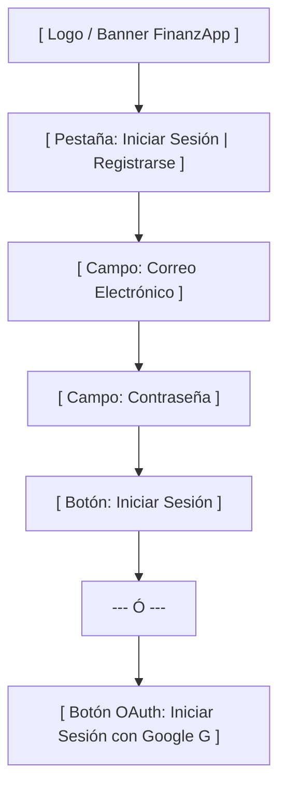
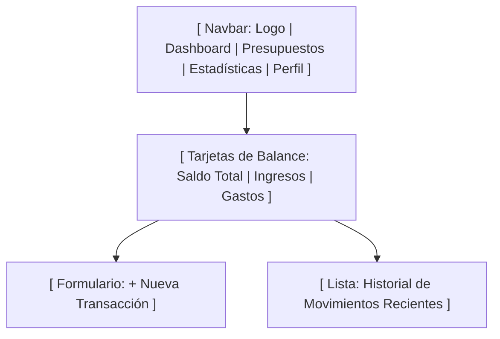
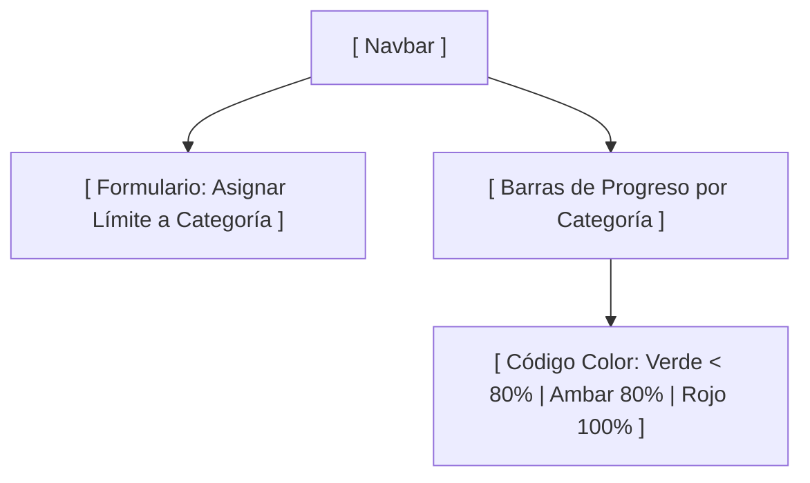
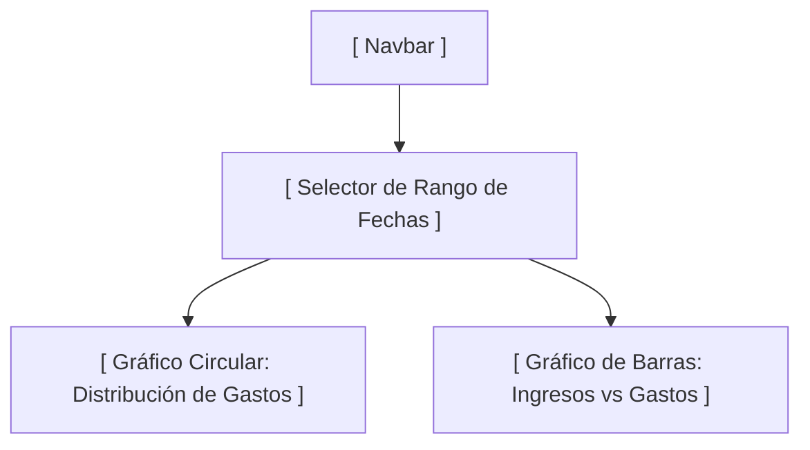

# 🎨 Documento de Mockups y Wireframes - FinanzApp

---

## 📌 1. Portada del Proyecto

* **Nombre del Proyecto:** FinanzApp - Sistema de Gestión de Finanzas Personales
* **Materia / Asignatura:** Proyecto de Programación / Desarrollo Web
* **Documento:** Diseños de Interfaz de Usuario (UI), Wireframes y Mockups
* **Autor / Desarrollador:** Edsen (`EdsenNow`)
* **Fecha:** Agosto 2026
* **Rama Git:** `mockups`
* **Issue Asociado:** Issue #26 (`HU-21: Diseño de Mockups y Wireframes de la interfaz de usuario`)

---

## 📝 2. Breve Descripción del Sistema

**FinanzApp** es una aplicación web interactiva diseñada para ayudar a las personas a gestionar su economía personal de forma sencilla, intuitiva y visual. El sistema permite registrar ingresos y gastos en tiempo real, clasificar movimientos en categorías, establecer topes presupuestarios mensuales y analizar hábitos financieros mediante gráficos estadísticos interactivos.

---

## 📱 3. Lista de Pantallas Diseñadas

El presente documento incluye los wireframes y mockups de las **4 pantallas principales** de la plataforma:

1. **Pantalla 1: Autenticación de Usuarios (Login y Registro)**
2. **Pantalla 2: Dashboard Principal (Control de Balance y Transacciones)**
3. **Pantalla 3: Gestión de Presupuestos (Topes y Alertas de Gasto)**
4. **Pantalla 4: Estadísticas y Reportes Financieros (Gráficos Interactivos)**

---

## 🖼️ 4. Wireframes / Mockups de las Pantallas Principales

---

### 🟢 Pantalla 1: Autenticación (Login / Registro / OAuth)

#### 📐 Diagrama de Estructura / Wireframe


#### 🎨 Mockup Visual (Layout ASCII)
```text
+------------------------------------------------------------------+
|                     💰 FinanzApp Personal                        |
|             "Toma el control de tu salud financiera"              |
+------------------------------------------------------------------+
|                                                                  |
|   +----------------------------------------------------------+   |
|   |   [ Iniciar Sesión ]            [ Registrarse ]          |   |
|   +----------------------------------------------------------+   |
|   |                                                          |   |
|   |   Correo Electrónico:                                    |   |
|   |   [ usuario@correo.com                               ]   |   |
|   |                                                          |   |
|   |   Contraseña:                                            |   |
|   |   [ **********                                       ]   |   |
|   |                                                          |   |
|   |   [ 🚀 Entrar a mi Cuenta                      ]        |   |
|   |                                                          |   |
|   |   --------------------- O ---------------------          |   |
|   |                                                          |   |
|   |   [ 🔴 Iniciar Sesión con Google               ]        |   |
|   +----------------------------------------------------------+   |
|                                                                  |
+------------------------------------------------------------------+
```

---

### 🟢 Pantalla 2: Dashboard Principal (Balance y Transacciones)

#### 📐 Diagrama de Estructura / Wireframe


#### 🎨 Mockup Visual (Layout ASCII)
```text
+------------------------------------------------------------------+
| 💰 FinanzApp  |  [Dashboard]  [Presupuestos]  [Estadísticas] | 👤 |
+------------------------------------------------------------------+
|                                                                  |
|  +-------------------+  +-------------------+  +---------------+ |
|  | 💵 Saldo Total    |  | 📈 Ingresos       |  | 📉 Gastos     | |
|  |   $ 15,400.00 MXN |  |   + $ 20,000.00    |  |   - $ 4,600.00| |
|  +-------------------+  +-------------------+  +---------------+ |
|                                                                  |
|  +--------------------------------+  +-------------------------+ |
|  | ➕ Registrar Movimiento        |  | 📋 Movimientos Recientes | |
|  | Tipo:  (x) Gasto   ( ) Ingreso |  | 🔴 Supermercado - $ 1500| |
|  | Monto: [ $ 1,500.00          ] |  | 🟢 Nomina Freelance+$5000| |
|  | Categ: [ Alimentos 🔻        ] |  | 🔴 Gasolina     - $ 800 | |
|  | Fecha: [ 2026-08-07          ] |  | 🔴 Servicios    - $ 2300| |
|  | [ 💾 Guardar Transacción     ] |  | [ Ver todo el historial]| |
|  +--------------------------------+  +-------------------------+ |
+------------------------------------------------------------------+
```

---

### 🟢 Pantalla 3: Gestión de Presupuestos (Topes y Alertas)

#### 📐 Diagrama de Estructura / Wireframe


#### 🎨 Mockup Visual (Layout ASCII)
```text
+------------------------------------------------------------------+
| 💰 FinanzApp  |  [Dashboard]  [Presupuestos]  [Estadísticas] | 👤 |
+------------------------------------------------------------------+
| 📊 Control de Presupuestos Mensuales                             |
|                                                                  |
|  +------------------------------------------------------------+  |
|  | 🛒 Alimentos y Súper                                       |  |
|  | Gastado: $3,200.00 / Límite: $4,000.00 (80%)                |  |
|  | [████████████████████████████████████░░░░░░░] 🟡 80%       |  |
|  +------------------------------------------------------------+  |
|                                                                  |
|  +------------------------------------------------------------+  |
|  | 🚗 Transporte y Gasolina                                   |  |
|  | Gastado: $2,500.00 / Límite: $2,000.00 (125%)               |  |
|  | [███████████████████████████████████████████] 🔴 EXCEDIDO  |  |
|  +------------------------------------------------------------+  |
|                                                                  |
|  +------------------------------------------------------------+  |
|  | 🎬 Entretenimiento                                         |  |
|  | Gastado: $600.00 / Límite: $1,500.00 (40%)                  |  |
|  | [████████████████░░░░░░░░░░░░░░░░░░░░░░░░░░░] 🟢 40%       |  |
|  +------------------------------------------------------------+  |
+------------------------------------------------------------------+
```

---

### 🟢 Pantalla 4: Estadísticas y Reportes Financieros

#### 📐 Diagrama de Estructura / Wireframe


#### 🎨 Mockup Visual (Layout ASCII)
```text
+------------------------------------------------------------------+
| 💰 FinanzApp  |  [Dashboard]  [Presupuestos]  [Estadísticas] | 👤 |
+------------------------------------------------------------------+
| 📈 Análisis Financiero y Reportes                                |
| Filtrar por Periodo: [ Agosto 2026 🔻 ] [ 📥 Exportar a CSV ]    |
|                                                                  |
|  +------------------------------+  +---------------------------+ |
|  | 🍩 Gastos por Categoría      |  | 📊 Ingresos vs Gastos     | |
|  |         /---------\          |  |  $20k | █                 | |
|  |        /   Súper   \         |  |  $15k | █     █           | |
|  |       |   (45%)     |        |  |  $10k | █  █  █  █        | |
|  |        \ Gasolina  /         |  |   $5k | █  █  █  █        | |
|  |         \---------/          |  |    $0 +------------       | |
|  | 🟢 Alimentos  🔴 Transporte  |  |       Ene Feb Mar Abr     | |
|  +------------------------------+  +---------------------------+ |
+------------------------------------------------------------------+
```

---

## 🔍 5. Breve Explicación de Cada Pantalla

1. **Pantalla de Autenticación:**  
   Permite el acceso seguro mediante credenciales de correo/contraseña o mediante un clic con Google OAuth. Garantiza la privacidad y el aislamiento de datos por usuario.

2. **Dashboard Principal:**  
   Es el centro de control financiero. Presenta el resumen ejecutivo del balance general (saldo disponible, total acumulado de ingresos y gastos del mes), junto a un formulario intuitivo para registrar movimientos rápidos e historial ordenado cronológicamente.

3. **Gestión de Presupuestos:**  
   Permite al usuario fijar límites financieros por categoría. Incluye barras de progreso de alerta cromática (Verde = <80%, Amarillo = 80-99%, Rojo = ≥100% Excedido) para incentivar el consumo responsable.

4. **Estadísticas y Reportes:**  
   Ofrece visualizaciones gráficas interactivas mediante Chart.js. Desglosa los hábitos de consumo por categoría y compara la tendencia mensual de ingresos frente a gastos, incluyendo exportación de respaldos en CSV.
